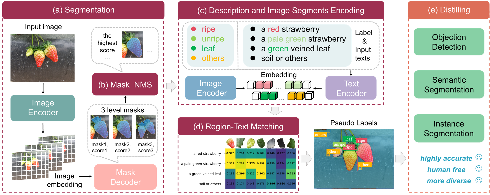

# Learn from Foundation Model: Fruits Detection Model without Manual Annotation
## Segmentation-Description-Matching-Distilling

**Zhejiang University, ZJU-Hangzhou Global Scientific and Technological 
Innovation Center**

Yanan Wang, [Zhenghao Fei](https://github.com/ZhenghaoFei), Ruichen Li, Yibin Ying

[[`Paper`](
https://doi.org/10.48550/arXiv.2411.16196)] [[`Project`](https://github.com/AgRoboticsResearch/SDM-D.git)]  [[`Dataset`](https://github.com/00mmw/MegaFruits.git)]



**🍄Segmentation-Description-Matching-Distilling** is a framework designed to distill small models that enable panoramic perception of complex agricultural scenes from foundation models without relying on manual labels. At its core is SDM, which operates without pre-training or significant resource consumption, within a segment-then-prompt paradigm. SDM demonstrates strong zero-shot performance across various fruit detection tasks (object detection, semantic segmentation, and instance segmentation), consistently outperforming SOTA OVD methods across various fruit perception tasks, demonstrating superior dexterity and generality.

## 🍇Installation
### 1. Prepare the environment
First, install PyTorch suitable for your machine, as well as small additional dependencies, and then install this repo as a Python package. On a CUDA GPU machine, the following will do the trick:

```bash
conda create -n SDM python=3.10
conda activate SDM
pip install torch torchvision # install the torch you need
git clone  https://github.com/AgRoboticsResearch/SDM-D.git
cd SDM-D
pip install -r requirements.txt
```

### 2. Install Segment-Anything-2 model
Please install the Segment-Anything-2 model first.

```bash
git clone https://github.com/facebookresearch/sam2.git
cd sam2
pip install -e .
```

### 3. Install OpenCLIP
Please install OpenCLIP.
```bash
pip install open_clip_torch
```

## 🚀Getting Started

### Download Checkpoints

1) First, we need to download the model weight file to the `./checkpoint` folder. All the model checkpoints can be downloaded by running:

```bash
cd checkpoints
./download_ckpts.sh
```

The model in SDM is - [sam2_hiera_large.pt](https://dl.fbaipublicfiles.com/segment_anything_2/072824/sam2_hiera_large.pt), you can also download this only.

2) The OpenCLIP can be utilized with `open_clip.create_model_and_transforms`,  and the model name and corresponding pretrained keys are compatible with the outputs of open_clip.list_pretrained().

```bash
import open_clip
open_clip.list_pretrained()
model, _, preprocess = open_clip.create_model_and_transforms('ViT-B-32', pretrained='laion2b_s34b_b79k')
```

### Label prediction


(1) Our project is very easy to use, just need to run SDM.py. 

First, please put `your dataset` into `./Images` folder, there is an example (image.jpg is also okay):

Images/

├── your dataset name/

│ ├── train/

│ │ │── 001.png

│ │ │── 002.png

│ │ │── ...

│ ├── val/

│ │ │── 012.png

│ │ │── 050.png

│ │ │── ...


Second, put your desrctipt

Third, please give parameters, you can run:

```bash
cd SDM-D

python SDM.py --image_segs_folder /path/to/images --out_folder /path/to/output --des_file /path/to/prompt.txt

```
Third, the structure of the `output` folder is as follows:

output/

│── mask/  # mask of the instance segmentation task

│── labels/  # label of the instance segmentation task in YOLO format

│── visual_new/  # visual of the instance segmentation task (SDM-D.py)

│── visual_all/  # visual of all masks of an image

│── json/  # json of the instance segmentation task

(2) If you want to get colorful visual results, please run SDM-D.py. You can set the colors what you want in SDM-D.py line 53-70 and 84-103.

```bash
python SDM_mask_color.py
```

(3) If you want to explore parameters that fit your own dataset, you can run `../notebook/SDM.ipynb`.


### Label transfer

(1) If you want to get object detection lables, just run:

```bash
python ../seg2label/seg2det.py
```

(2) If you want to get semantic segmentation labels, just run:

```bash
python ../seg2label/seg2semantic.py
```

(3) If you want to get labels for specific kinds of objects, you can abstract their labels just run:

```bash
python ../seg2label/abstract.py
```
    
## The design of description texts

The design of prompts greatly affects the model performance, particularly in tasks involving fine-grained distinctions. We summarize an effective prompt template: `a/an {color} {shape} {object} with {feature}`, where the color description is the most crucial. Here is some examples of the prompt design:


Although some error can be avoided by adding a new description (e.g., Fig.(c)"black background"), considering the generality of the entire dataset, We don't recommend it. Regarding the design of the number of prompt texts, we recommend that users consider the characteristics of objects within the entire scene. While an excessive number of prompts may lead to higher accuracy, it can adversely affect the model's generalization ability, rendering it less suitable for large-scale datasets and requiring a lot of time and effort.

## Distillation

These pseudo-labels generated by SDM can serve as supervision for small, edge-deployable models (students), bypassing the need for costly manual annotation. The SDM-D is highly versatile and model-agnostic, with no restrictions on the choice of the student model. Any compact model optimized for a downstream task can be seamlessly integrated into the distillation process. And the is no distillation loss in SDM-D, all the distilled models have better accuracy.

## Model Description


### Comparison of Inference Time and GPU Memory Allocation for Each Method

|     | **Grounded SAM** | **YOLO-World** | **SDM** | **SDM-D (YOLOv8s)** |
|-------------------------|------------------|----------------|---------|---------------------|
|Inference Time (ms)| 8,090.81         | 99.32         | 7,615.08         | **18.96**         |
| **GPU Memory Allocation (MiB)** | 7,602         | 2,268         | 6,650         | **878**         |
|                                                                  |

## Dataset

We introduce a high-quality, comprehensive fruit instance segmentation dataset named [[`MegaFruits`](https://github.com/00mmw/MegaFruits.git)]. This dataset encompasses 20,242 images of strawberries with 569,382 pseudo masks, 2,400 manually labeled images of yellow peaches with 10,169 masks, and 2,540 manually labeled images of blueberries with 20,656 masks. Leveraging the capabilities of our method, we are able to generate such a large scale of pseudo-segmentation labels. We anticipate this resource will catalyze further research and practical advancements in agricultural vision systems.

## 💘Acknowledgements

- [SAM 2](https://github.com/facebookresearch/sam2.git)
- [OpenCLIP](https://github.com/mlfoundations/open_clip.git)

## 🔥Contributors

Our project wouldn't be possible without the contributions of these amazing people! Thank you all for making this project better.


